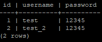
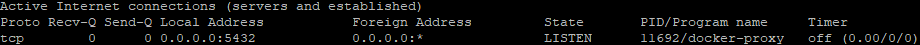
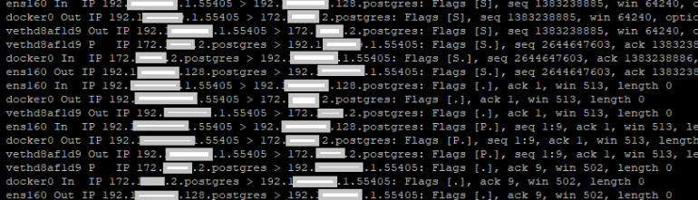
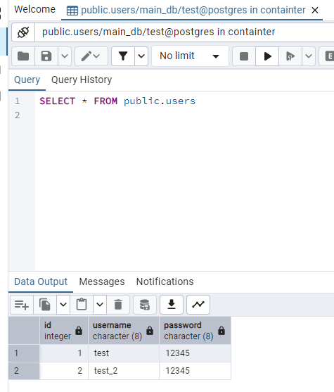

 Task_1 PostgreSQL
 
 I downlaoded PostgreSQL from docker hub as a pre-built image by executing following command:
 <i> docker pull postges:latest</i>
 
  After reading the documentation for PostgreSQL from docker hub (https://hub.docker.com/_/postgres) I run <i>docker volume create postgres-data </i> to persist some future data in the database.
  I executed the following command to create a PostgreSQL container:
  <i>docker run -d --name postgres-db -e POSTGRES_USER=test -e POSTGRES_PASSWORD=test -e POSTGRES_DB=main_db -p 5432:5432 -v postgres_data:/var/lib/postgresql/data postgres:latest </i>
 
  Postgres instace was started <i> docker ps </i>
 
  
 
  I connected to the container via psql (terminal connection) running the following command:
  <i> docker exec -it postgres-db psql -d main_db -U test </i> # -it interactive terminal, -d database name, -U username
 
  Simple table was created <i> docker exec -it postgres-db psql -d main_db -U test -c 'CREATE TABLE users(id int, username char(8),password char(8))' </i>
  
  I populated the table users <i> docker exec -it postgres-db psql -d main_db -U test -c "INSERT INTO users (id,username,password) VALUES (1,'test',12345);" </i> and <i> docker exec -it postgres-db psql -d main_db -U test -c "INSERT INTO users VALUES (2,'test_2',12345);" </i>
 
  Quick check <i>  docker exec -it postgres-db psql -d main_db -U test -c "SELECT * FROM users;" </i>
 
  
 
 
  As we can see the postgres-db container is listening on 0.0.0.0:5432
 
 
 
  So I ran simple test via PGadmin (I wanted to join to that database from my host computer)
 
  I dumped incoming packets via <i> tcpdump -nli any port 5432 </i> so I could see what is going on.
  As we can see the test ran successfully.
 
 
 
  
 

  I designed specific SQL queries to create a tables and relations between them.

  <i> CREATE TABLE credentials (
	username varchar(255) PRIMARY KEY,
	password_hash varchar(72) NOT NULL,
	email varchar(255) NOT NULL
);

CREATE TABLE userstat (
	username varchar(255) PRIMARY KEY,
	status varchar(255) NOT NULL,

	FOREIGN KEY (username) REFERENCES credentials (username)
);

CREATE TABLE userlog(
	userlog_id SERIAL PRIMARY KEY,
	username varchar (255),
	login_status varchar(255) NOT NULL,
	geo_ip varchar(3) NOT NULL,
	tmstmp TIMESTAMP NOT NULL,

	FOREIGN KEY (username) REFERENCES credentials (username)
) </i>
 