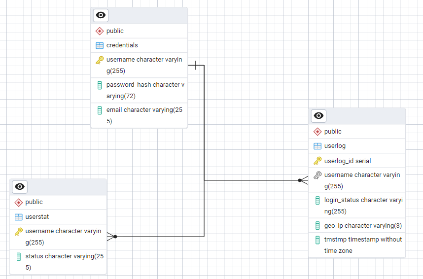
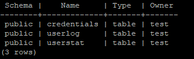

<b>Task_1 PostgreSQL</b>

<b>I downlaoded PostgreSQL from docker hub as a pre-built image by executing following command: </b>
<i> docker pull postges:latest</i>

 <b>After reading the documentation for PostgreSQL from docker hub (https://hub.docker.com/_/postgres) I run</b> 
 <i>docker volume create postgres-data </i> 
 <b> to persist some future data in the database.</b>

 <b>I executed the following command to create a PostgreSQL container:</b>
 <i>docker run -d --name postgres-db -e POSTGRES_USER=test -e POSTGRES_PASSWORD=test -e POSTGRES_DB=main_db -p 5432:5432 -v postgres_data:/var/lib/postgresql/data postgres:latest </i>

<b> Postgres instace was started </b>
<i> docker ps </i>

 

 <b>I connected to the container via psql (terminal connection) running the following command:</b>
 <i> docker exec -it postgres-db psql -d main_db -U test </i> # -it interactive terminal, -d database name, -U username

 <b>Simple table was created </b>
<i> docker exec -it postgres-db psql -d main_db -U test -c 'CREATE TABLE users(id int, username char(8),password char(8))' </i>
 
 <b>I populated the table users </b>
 <i> docker exec -it postgres-db psql -d main_db -U test -c "INSERT INTO users (id,username,password) VALUES (1,'test',12345);" </i> and <i> docker exec -it postgres-db psql -d main_db -U test -c "INSERT INTO users VALUES (2,'test_2',12345);" </i>

 <b>Quick check</b> 
 <i>  docker exec -it postgres-db psql -d main_db -U test -c "SELECT * FROM users;" </i>

 

 <b>As we can see the postgres-db container is listening on 0.0.0.0:5432</b>

 <b>So I ran simple test via PGadmin (I wanted to join to that database from my host computer)</b>

 <b>I dumped incoming packets via</b>
 <i> tcpdump -nli any port 5432 </i>
 <b>so I could see what is going on. As we can see the test ran successfully.</b>

 

<b> I designed specific SQL queries to create a tables and relations between them. </b>

<i>CREATE TABLE credentials (username varchar(255) PRIMARY KEY password_hash varchar(72) NOT NULL, email varchar(255) NOT NULL);

CREATE TABLE userstat (username varchar(255) PRIMARY KEY,status varchar(255) NOT NULL,FOREIGN KEY (username) REFERENCES credentials (username));

CREATE TABLE userlog(userlog_id SERIAL PRIMARY KEY,username varchar (255),login_status varchar(255) NOT NULL,geo_ip varchar(3) NOT NULL,tmstmp TIMESTAMP NOT NULL,FOREIGN KEY (username) REFERENCES credentials (username)); 
</i>

<b>The database structure: </b>

<b> Executing </b><i>docker exec -it postgres-db psql -d main_db -U test -c "\dt"</i><b> I got:</b>

 