<br><b>Task_1 Backend (Java Spring Boot Framework)</b>

The https://start.spring.io/ is a site where you can generate your own Java Spring Boot project.

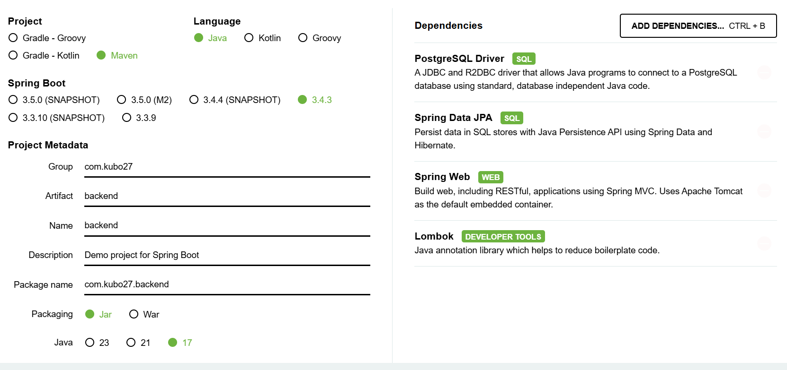

The project can be downloaded as a zip file.

After unziping the project I navigated to the backend/src/main/resources/application.properties and configured the connection to the postgresql instance.
```
spring.datasource.url=jdbc:postgresql://localhost:5432/main_db
spring.datasource.username=test
spring.datasource.password=test
spring.jpa.show-sql=true
```
<i> ./mvnw spring-boot:run </i> was executed and backend>postgres db connection established

The next step was to create Java entity class, which represents table in database. This class is annotated with @Entity.
The first java file: <b>Users.java</b> in /src/main/java/com/kubo27/backend/ path. 
#username as a primary key
```
package com.kubo27.backend.model;

import lombok.*;
import jakarta.persistence.*;

@Data
@Entity
@Table(name = "users")
public class Users{

        @Id
        private String username;
        @Column(nullable = false)
        private String password_hash;
        @Column(nullable = false)
        private String email;
        @Column (nullable = false)
        private String status;

}
```


The next file : <b>UsersRepository.java</b> is a JPA repository as an interface that communicates with SQL db without using sql query. JPA automatically provides a CRUD operations (create,read,update,delete).
 

```
package com.kubo27.backend.repository;

import com.kubo27.backend.model.Users;
import org.springframework.data.jpa.repository.JpaRepository;

public interface UsersRepository extends JpaRepository<Users, String>{
}
```


And the last one <b>UserController.java</b>. This file contains all the logic for the user registration via REST API.
I created only one mapping for testing purposes.


```
package com.kubo27.backend.controller;

import org.springframework.beans.factory.annotation.Autowired;
import org.springframework.web.bind.annotation.*;
import com.kubo27.backend.repository.*;
import com.kubo27.backend.model.*;


@RestController
@RequestMapping("/api/user")
public class UserController {

    @Autowired
    UsersRepository usersRepository;

    @PostMapping
    public String create(@RequestBody Users users) {
        usersRepository.save(users);
        return "User is created";
    }


}
```


```
curl -X POST "http://localhost:8080/api/user" -H "Content-Type: application/json" -d '{"username": "testuser","password_hash":"124faasf21","email":"test@user.com","status":"verified"}'
```
As we can see the user was successfully registered:
```
docker exec -it postgres-db psql -d main_db -U test -c "SELECT * FROM users;"
```
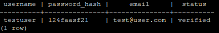


It is time to create the logic behind the calculation of password hash and user's status verification (In the curl above, I hardcoded the status and password_hash into table)

Lets take a look on "<b>user verification problem</b>". After user registration the status of the account will be set to unverified by default.

I decieded to add new column into the table called <b>token</b>. This <b>token</b> will be autogenerated after user registration and if the user use /api/verification with that <b>token</b> his status will be set to "verified" - (in the real world scenario the token would be send to email).

The column can be added to the table by the following SQL query inside the psql's -c flag:
```
 docker exec -it postgres-db psql -d main_db -U test -c "ALTER TABLE users ADD COLUMN token varchar(255);"
```
Now lets delete the row with username "testuser":
```
docker exec -it postgres-db psql -d main_db -U test -c "DELETE FROM users where username='testuser';"
```
The table users is now empty:
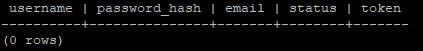

I added a few new lines into UserController.java to set user's status to "unverified" and auto-generate token. setStatus and setToken are setters of Users.java (dependency Lombok).

After the user provides username,  password and email address via /api/user/register, the data will be written into the table users.  User's status will be set to "unverified" and token will be auto-generated. Another @PostMapping is for verifying user account (simulation of clicking on a link in mail). The /api/user/verify is created with two input parameters - username and token - to verify the user account and change the status to "verified".
```
@RestController
@RequestMapping("/api/user")
public class UserController {

    @Autowired
    UsersRepository usersRepository;

    @PostMapping("/register")
    public String create(@RequestBody Users users) {
        users.setStatus("unverified");
        users.setToken(generateRandomToken());
        usersRepository.save(users);

        return "User is created";
    }

    @PostMapping("/verify")
    public String verifyUser(@RequestParam String username,@RequestParam String token) {
            Optional<Users> user = usersRepository.findByUsername(username);

            if(user.isPresent()) {
                Users pickedUser = user.get();
                if(pickedUser.getToken().equals(token)){
                        pickedUser.setStatus("verified");
                        usersRepository.save(pickedUser);
                        return "User verified successfully!";
                }
                else {
                        return "Invalid token!";
                }
            }
            else{
                return "User not found!";

            }
    }

private String generateRandomToken(){
        Random random = new Random();
        int randomNum = random.nextInt(10000) + 20000;

        return String.valueOf(randomNum);
    }


}

```

Line ``` Optional<Users> findByUsername(username); ``` need to be added into UsersRepository.java file. The UsersRepository.java is responsible for interacting with the database. This allows Spring Data JPA to automatically generate a SQL query like ``` SELECT * FROM users WHERE username = 'someUsername'; ```

I ran the test
```
curl -X POST "http://localhost:8080/api/user/register" -H "Content-Type: application/json" -d '{"username": "testuser","password_hash":"124faasf21","email":"test@user.com"}'
```
And I got
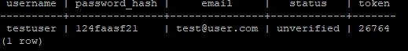

Now its time to test /api/user/verify". 

- when i provided wrong username
```
curl -X POST "http://localhost:8080/api/user/verify?username=test&token=26764"
```
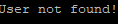

Wrong token:
```
curl -X POST "http://localhost:8080/api/user/verify?username=testuser&token=1111"
```
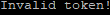

Still "unverified"
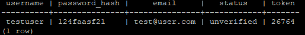

Last test (username exists and token provided within POST matches token in the row)
```
curl -X POST "http://localhost:8080/api/user/verify?username=testuser&token=26764"
```
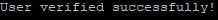

Status was changed to "verified"

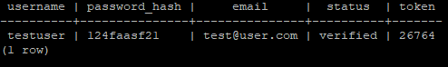

In the next step I implemented password hash calculating via BCrypt. New dependency need to be added into my project (pom.xml)
```
<dependency>
    <groupId>org.springframework.security</groupId>
    <artifactId>spring-security-core</artifactId>
    <version>5.7.3</version>
</dependency>
```

After that I imported these packages into my UserController.java file. Below we can see what is needed to calculate hash of the password.
```
PasswordEncoder passwordEncoder = new BCryptPasswordEncoder();
users.setPassword_hash(passwordEncoder.encode(users.getPassword_hash()));
```

To test it:
```
docker exec -it postgres-db psql -d main_db -U test -c "DELETE FROM users where username='testuser';"
curl -X POST "http://localhost:8080/api/user/register" -H "Content-Type: application/json" -d '{"username": "testuser","password_hash":"mynewpassword","email":"test@user.com"}'
curl -X POST "http://localhost:8080/api/user/verify?username=testuser&token=26809"
```

As we can see password is securly stored:
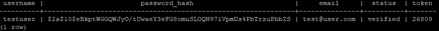


The last api is /api/users/login - this api is needed for user login - (compare given password with the hash of password stored in the table)

```
    @PostMapping("/login")
    private String userLogin(@RequestParam String username, @RequestParam String password) {
        Optional<Users> user = usersRepository.findByUsername(username);
        if(user.isPresent()) {
                Users pickedUser = user.get();
                System.out.println(pickedUser.getPassword_hash()+"\n");
                if(passwordEncoder.matches(password,pickedUser.getPassword_hash())){
                        return "Login successfull!";
                }
                else {
                        return "Incorrect password!";
                }
        }
        else{
                return "User not found!";
        }

    }

```

Test (wrong password)
```
curl -X POST "http://localhost:8080/api/user/login?username=testuser&password=wrongpassword"
```
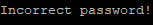

Test (correct password)
```
 curl -X POST "http://localhost:8080/api/user/login?username=testuser&password=mynewpassword"
```
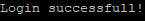