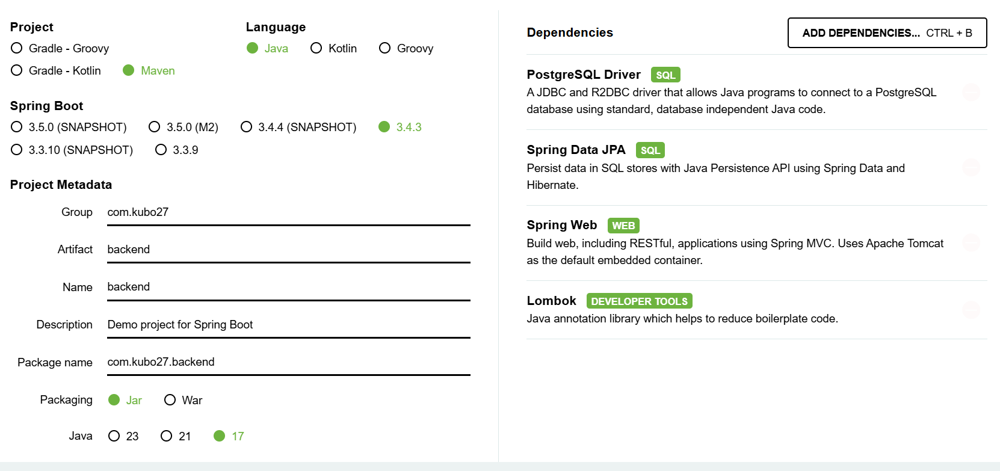

<br><b>Task_1 Backend (Java Spring Boot Framework)</b>

I navigated to the https://start.spring.io/ and designed new project for my backend.



I downloaded generated Java Spring Boot project compressed file and moved it via scp from my host PC to the oracle linux machine

<i>scp backend.zip username@192.x.x.128:/home/username/</i>

After unziping the project I navigated to the backend/src/main/resources/application.properties and configured the connection to the postgresql instance.
```
<i>spring.datasource.url=jdbc:postgresql://localhost:5432/main_db
spring.datasource.username=test
spring.datasource.password=test
spring.jpa.show-sql=true</i>
```
<i> ./mvnw spring-boot:run </i> was executed and backend>postgres db connection established

In the next step I coded backend logic. The first java file was Users.java in /src/main/java/com/kubo27/backend/ path.

<i>
```
package com.kubo27.backend.model;

import lombok.*;
import jakarta.persistence.*;

@Data
@Entity
@Table(name = "users")
public class Users{

        @Id
        private String username;
        @Column(nullable = false)
        private String password_hash;
        @Column(nullable = false)
        private String email;
        @Column (nullable = false)
        private String status;

}
```
</i>

The next file was UsersRepository.java

<i>
```
package com.kubo27.backend.repository;

import com.kubo27.backend.model.Users;
import org.springframework.data.jpa.repository.JpaRepository;

public interface UsersRepository extends JpaRepository<Users, String>{
}
```
</i>

And the last file UserController.java

<i>
```
package com.kubo27.backend.controller;

import org.springframework.beans.factory.annotation.Autowired;
import org.springframework.web.bind.annotation.*;
import com.kubo27.backend.repository.*;
import com.kubo27.backend.model.*;


@RestController
@RequestMapping("/api/user")
public class UserController {

    @Autowired
    UsersRepository usersRepository;

    @PostMapping
    public String create(@RequestBody Users users) {
        usersRepository.save(users);
        return "User is created";
    }


}
```
</i>

